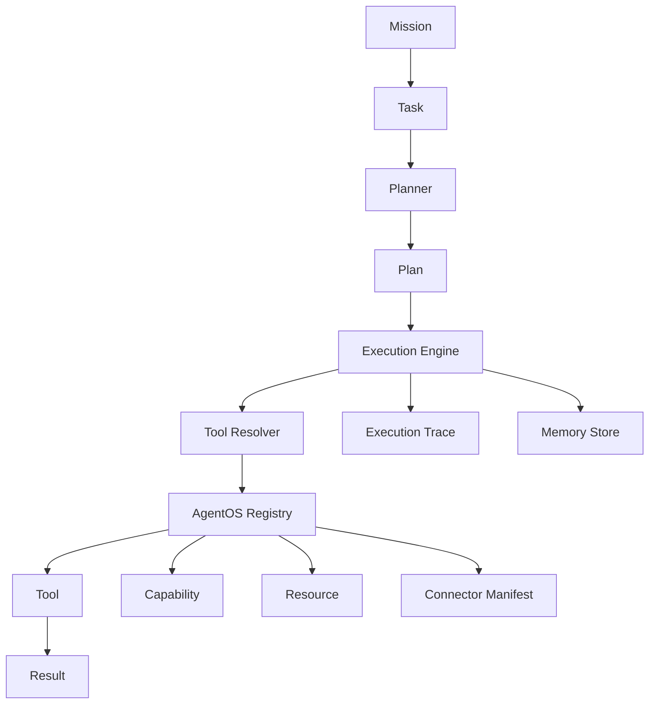

# AgentOS Architecture

AgentOS is an operating system for intelligent work.

It is not an LLM framework. It is a task-centric infrastructure layer for
building agents that can plan, use tools, remember context, and operate across
real workflows.

## Core Flow

```text
Mission
  ↓
Task
  ↓
Planner
  ↓
Plan
  ↓
Execution Engine
  ↓
Tool Resolver
  ↓
Registry
  ↓
Tool
  ↓
Result
```



## Why Task-Centric

Many frameworks center the model:

```text
User -> LLM -> Tools
```

AgentOS centers the work:

```text
User -> Task -> Planner -> Execution Engine -> Tools -> Result
```

This keeps the architecture provider-agnostic. A future planner may use an LLM,
rules, heuristics, another service, or a combination of strategies. The LLM is a
dependency, not the operating center.

## Models Are Implementation Details

AgentOS treats models as useful dependencies that can appear inside planners,
tools, or future execution strategies. They are not the primary architectural
boundary.

This matters because intelligent work systems need to answer questions beyond
"which model was called?":

- What task was requested?
- What plan was produced?
- Which capabilities were available?
- Which tool was selected?
- Which connector provided that tool?
- What happened during execution?
- What result, trace, and errors were returned?

By making `Task`, `Plan`, `Capability`, `Tool`, `Execution Trace`, and `Result`
first-class concepts, AgentOS keeps execution understandable even when the
underlying planner changes. A deterministic planner, an LLM planner, and a
hybrid planner should all be able to use the same registry, tool, memory, and
result contracts.

This is also why AgentOS avoids hard-coding provider assumptions into core
objects. Provider-specific behavior should live behind replaceable components:
planner strategies, tools, memory providers, connectors, or future execution
engines.

## Mission

A `Mission` is a long-running objective that can produce many tasks.

Example:

```text
Grow my Discord community by 30% this month.
```

Current status: the type exists. AgentOS does not yet orchestrate missions.

## Task

A `Task` is one objective from a user, API, workflow, or future connector.

Example:

```text
Summarize the top complaints in our Discord community this week.
```

`agent.run()` normalizes string input into a `Task`.

## Planner

A `Planner` turns a task into a `Plan`.

Current implementation:

- `RuleBasedPlanner`
- deterministic keyword rules
- no LLM calls
- no external services

The planner is replaceable through the `Planner` contract.

## Plan and Plan Step

A `Plan` describes how a task should be completed.

A `PlanStep` is one ordered step. Steps include a type, description, status,
optional tool hints, input, output, error, and metadata.

The current planner creates simple three-step plans for analysis, messaging,
payment, or default tasks.

## Execution Engine

The `ExecutionEngine` processes plan steps and returns a `Result`.

Current implementation:

- `SimpleExecutionEngine`
- executes steps sequentially
- asks the tool resolver for a tool
- invokes local registered tools
- records `toolCalls`
- emits typed execution trace entries

It does not call external APIs, run connectors, use LLMs, or persist state.

## Tool Resolver

`ToolResolver` discovers tools from `AgentOSRegistry`.

It can resolve by:

- explicit tool id
- required capability
- step type
- step description

The execution engine depends on the resolver contract instead of searching the
registry directly.

## Registry

`AgentOSRegistry` is the in-memory kernel catalog.

It manages:

- capabilities
- connectors
- tools
- resources

The registry supports registration, duplicate detection, discovery, summaries,
and relationship validation. It does not execute tools or connect to external
services.

## Tool

A `Tool` is a local callable capability.

Tools return a standard `ToolExecutionResult`:

```ts
{
  success: boolean;
  output?: unknown;
  metadata?: Record<string, unknown>;
  durationMs: number;
  errors: AgentOSError[];
}
```

Current mock tools:

- `PrepareMessageTool`
- `SummarizeMessagesTool`
- `AnalyzeTextTool`
- `CreateInvoiceTool`
- `EchoTool`

These are local and deterministic.

## Tool Authoring API

Developers define tools with `defineTool()`.

```ts
import { defineTool } from "@agentos/sdk";

export const sentimentTool = defineTool({
  id: "sentiment-demo",
  name: "Sentiment Demo",
  description: "Detects simple local sentiment.",
  capability: "research",
  version: "1.0.0",
  execute({ input }) {
    return {
      success: true,
      output: input,
      metadata: {},
      durationMs: 1,
      errors: [],
    };
  },
});
```

`defineTool()` returns an immutable definition with:

- `inspect()`
- `summary()`
- registry-compatible `execute(input, context)`

Helper factories exist for common categories:

- `defineMessagingTool()`
- `defineResearchTool()`
- `defineBusinessTool()`

## Memory

Memory is provider-agnostic.

Current implementation:

- `MemoryStore` contract
- `InMemoryMemoryStore`
- scoped records
- simple keyword search
- no vector database
- no embeddings
- no persistence

`agent.run()` can read scoped memory before planning and write a summary record
after execution. Memory can be disabled per run.

## Runtime

`defineAgent()` composes:

- planner
- execution engine
- registry
- memory store
- metadata
- optional capabilities and permissions

`agent.run()` performs the current local runtime flow:

```text
Input -> Task -> Memory Read -> Planner -> Plan Validation -> Execution -> Memory Write -> Result
```

It is the first end-to-end developer experience milestone. It remains local and
mocked.

## Result and Trace

`Result` contains:

- task id
- status
- answer
- plan
- execution trace
- tool calls
- memory writes placeholder
- errors
- timing
- metadata

Trace entries include events such as:

- `TaskStarted`
- `PlanStarted`
- `StepStarted`
- `ToolRequested`
- `ToolResolved`
- `ToolStarted`
- `ToolCompleted`
- `ToolFailed`
- `StepCompleted`
- `TaskCompleted`

## What Is Not Implemented Yet

AgentOS does not yet include:

- real connectors
- external APIs
- LLM provider integration
- database-backed memory
- vector search
- dashboard functionality
- production orchestration
- distributed execution

Those are roadmap items, not current behavior.
