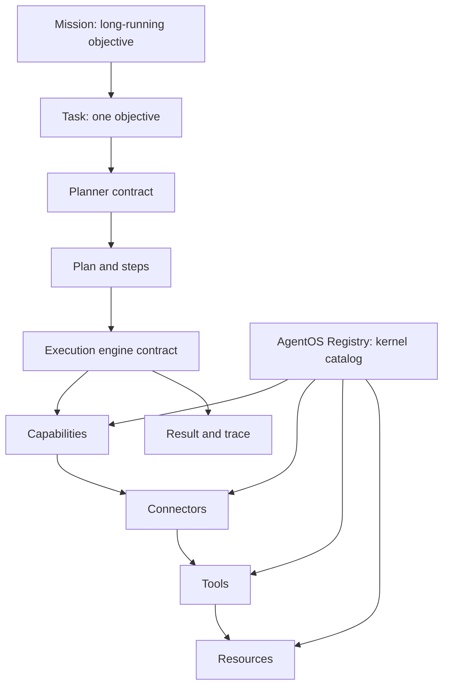

# AgentOS

AgentOS is an open-source AI agent infrastructure layer for the Global South,
starting with Africa.

It exists to help developers build AI agents that can reason, remember, use
tools, and operate across real-world workflows such as messaging, payments,
community management, research, and business operations.

This repository is intentionally starting small. The current work provides the
MVP foundation: shared domain types, a rule-based planner, a resolver-driven
execution engine, an in-memory registry, local mock tools, an in-memory memory
store, and agent composition helpers.

AgentOS now includes an end-to-end local `agent.run()` path for development
demos. It does not yet include real connectors, database-backed memory, LLM
integration, or dashboard functionality.

## Why AgentOS Exists

Most agent infrastructure is designed around well-resourced markets, stable
connectivity, and workflows that do not always reflect how people and businesses
operate across Africa and the wider Global South.

AgentOS aims to provide practical, extensible infrastructure for developers
building agents that understand local contexts, integrate with regional tools,
and support real operational work.

## Monorepo Structure

```text
apps/
  web/          Next.js app shell for the future dashboard and developer console

packages/
  core/         Core planner, execution, registry, and agent composition helpers
  tools/        Placeholder package for future tool definitions and helpers
  memory/       Provider-agnostic memory contracts and in-memory store
  connectors/  Placeholder package for future provider connectors
  sdk/          Developer-facing SDK exports
  types/        Shared TypeScript domain and architecture types
  config/       Shared TypeScript configuration
```

## Architecture

AgentOS is task-centric, not LLM-centric.

Many AI frameworks center the language model:

```text
User -> LLM -> Tools
```

AgentOS centers the work the user wants done:

```text
Mission
  ↓
Task
  ↓
Planner
  ↓
Plan
  ↓
Execution Engine
  ↓
Capabilities
  ↓
Connectors
  ↓
Tools
  ↓
Resources
  ↓
Result
```

The LLM is not the operating center of AgentOS. It is one possible component a
planner or execution engine may use later. The core model starts with tasks,
plans, tools, connectors, memory concepts, context, traces, and results.



## Domain Model

The shared domain model lives in `@agentos/types` and is re-exported from
`@agentos/sdk`.

Current concepts:

- `Mission`: a long-running objective that can generate multiple tasks.
- `Agent`: an autonomous worker with capabilities, tools, memory policy, and
  permissions.
- `Task`: one user objective from a source such as an app, API, chat, or
  workflow.
- `Plan`: the proposed way to complete a task.
- `PlanStep`: one ordered action inside a plan.
- `Capability`: a provider-independent ability such as messaging, search,
  scheduling, payments, or analytics.
- `Tool`: a callable capability with schemas and an execution signature.
- `Connector`: a provider that exposes tools, such as a Discord or payments
  connector.
- `Resource`: anything AgentOS can work with, such as a message, document,
  spreadsheet, transaction, repository, thread, or database record.
- `MemoryRecord`, `MemoryPolicy`, and `MemoryQuery`: storage-agnostic memory
  concepts.
- `ExecutionContext`: the information available while work is being completed.
- `Result`: the final task outcome.
- `ExecutionTrace`: observable history for planning and execution events.
- `Planner`, `PlannerStrategy`, and `ExecutionEngine`: contracts for future
  implementations.
- `CapabilityRegistry`, `ResourceRegistry`, and `ConnectorRegistry`: registry
  interfaces for future runtime discovery.
- `AgentOSRegistry`: the in-memory kernel catalog for capabilities, connectors,
  tools, and resources.
- `MemoryStore` and `InMemoryMemoryStore`: provider-agnostic memory contracts
  and a local in-memory implementation for development.

No database-backed memory, real connectors, dashboard, external APIs, or LLM
calls are implemented yet.

## Architectural Contracts

Phase 3 completes the MVP foundation with interfaces only:

- Missions group long-running work without orchestrating it yet.
- Capabilities describe abstract abilities independently of providers.
- Connectors expose provider-backed capabilities and tools.
- Resources describe the objects AgentOS reads, writes, references, or acts on.
- Planners produce plans through interchangeable strategies such as rule-based,
  LLM-backed, hybrid, or custom planners.
- Execution engines define how plans and steps will eventually be controlled,
  paused, resumed, cancelled, and retried.
- Registries define how capabilities, resources, and connectors will eventually
  be discovered.
- Execution events provide a strongly typed event vocabulary for observability.

The contracts are intentionally provider-agnostic. Discord, Slack, WhatsApp,
Gmail, a local file system, a payment provider, or an LLM provider should be
implementation details behind connectors, tools, or planner strategies.

## Registry Kernel

The first AgentOS kernel component is `AgentOSRegistry`.

It is a central in-memory catalog for discovering what the operating system can
do and what it can work with:

- Capabilities: provider-independent abilities like messaging or payments.
- Connectors: provider-backed integrations that expose capabilities and tools.
- Tools: callable abilities linked to capabilities and optional connector
  origins.
- Resources: objects AgentOS can reference, read, write, or act on.

The registry does not execute tools, call external APIs, persist data, or connect
to providers. It only manages registration, discovery, summaries, and
relationship validation.

## Tool Execution

Phase 11 introduces the first real capability execution path. The execution
engine no longer creates generic fake step output by itself. Instead, it uses a
`ToolResolver` to discover tools from `AgentOSRegistry`.

```text
Task -> Planner -> Plan -> Execution Engine -> Tool Resolver -> Registry -> Tool -> Tool Result
```

The resolver can match tools by explicit tool id, required capability, step
type, and step description. The execution engine remains independent from
concrete tools.

Every tool returns a `ToolExecutionResult` with `success`, `output`, `metadata`,
`durationMs`, and `errors`. The final `Result` includes `toolCalls`, and the
trace includes events such as `ToolRequested`, `ToolResolved`, `ToolStarted`,
`ToolCompleted`, and `ToolFailed`.

## Tool Authoring

Developers can define local tools with `defineTool()`. No classes, decorators,
reflection, external services, or connectors are required.

```ts
import { ToolCategory, ToolVisibility, defineTool } from "@agentos/sdk";

export const summarizeMessages = defineTool<{ messages: string[] }, string>({
  id: "summarize-messages",
  name: "Summarize Messages",
  description: "Summarizes community conversations.",
  capability: "messaging",
  category: ToolCategory.Community,
  version: "1.0.0",
  tags: ["community", "summary"],
  visibility: ToolVisibility.Public,
  execute({ input }) {
    const startedAt = Date.now();

    return {
      success: true,
      output: input.messages.join("\n"),
      metadata: {
        messageCount: input.messages.length,
      },
      durationMs: Date.now() - startedAt,
      errors: [],
    };
  },
});
```

`defineTool()` returns an immutable tool definition with:

- `inspect()`: detailed metadata for debugging and documentation.
- `summary()`: lightweight information for dashboards and catalogs.
- `execute(input, context)`: the registry-compatible execution function used by
  the execution engine.

Tool validation checks required `id`, `name`, `capability`, and `execute`
fields. Versions use simple `x.y.z` semantic version validation. Duplicate IDs
are rejected by `AgentOSRegistry` during registration, and
`validateToolDefinitionConfig()` can also check a provided `existingIds` list for
preflight validation.

Helper factories are available for common capabilities:

```ts
import { defineBusinessTool, defineMessagingTool, defineResearchTool } from "@agentos/sdk";
```

These helpers prefill capability and category defaults while still allowing
overrides. Best practice is to keep tools small, deterministic where possible,
versioned, tagged, and explicit about metadata and permissions.

Registering a tool is intentionally direct:

```ts
registry.registerTool(summarizeMessages);
```

## Memory Layer

`InMemoryMemoryStore` is the first memory implementation. It is intentionally
small and local:

- Writes scoped memory records.
- Reads records by id.
- Searches with simple keyword matching across content, type, scope, and
  metadata.
- Lists records globally or by scope.
- Deletes records by id.
- Clears all records or records within a scope.

It does not use a database, vector embeddings, semantic search, LLM extraction,
or external storage.

## Agent Composition

`defineAgent()` creates an immutable `AgentDefinition` from independent AgentOS
components. It is dependency injection first: planners, execution engines,
registries, and memory stores remain replaceable.

An agent definition wires together:

- a planner
- an execution engine
- a registry
- a memory store
- optional capabilities and permissions

This lets developers replace the planner, memory store, execution engine, or
registry without changing the agent definition shape.

`agent.run()` is the first end-to-end local runtime path:

```text
Input -> Task -> Planner -> Plan -> Execution Engine -> Tool Resolver -> Registry -> Tool -> Result
```

It executes local mock tools through the registry. It does not call real
connectors, external APIs, LLMs, databases, or real-world services.

## Example Usage

```ts
import {
  InMemoryMemoryStore,
  RuleBasedPlanner,
  SimpleExecutionEngine,
  createAgentOSRegistryBootstrapExample,
  defineAgent,
} from "@agentos/sdk";

const communityManager = defineAgent({
  id: "community-manager",
  name: "Community Manager",
  description: "Manages online communities.",
  planner: new RuleBasedPlanner(),
  executionEngine: new SimpleExecutionEngine(),
  registry: createAgentOSRegistryBootstrapExample(),
  memoryStore: new InMemoryMemoryStore(),
});

const result = await communityManager.run(
  "Summarize the top complaints in our Discord community this week"
);

console.log(result.answer);
console.log(result.trace);
console.log(result.toolCalls);
```

The first planner is intentionally simple. `RuleBasedPlanner` inspects task
input and deterministically creates a three-step plan for analysis, messaging,
payment, or default tasks. It does not execute tools, call LLMs, use connectors,
or write memory.

`SimpleExecutionEngine` validates the task and plan, asks `ToolResolver` to find
registered tools, executes local mock tools, records `toolCalls`, emits typed
tool traces, and returns a structured `Result`.

The current mock tools are:

- `PrepareMessageTool`
- `SummarizeMessagesTool`
- `AnalyzeTextTool`
- `CreateInvoiceTool`
- `EchoTool`

These tools are local and deterministic. Future real connectors can replace the
mock tools behind the same registry and resolver shape.

## Runnable Examples

The `examples/` directory contains small TypeScript scripts that demonstrate
the current local AgentOS runtime:

```bash
pnpm example:basic
pnpm example:community
pnpm example:business
pnpm example:research
pnpm example:memory
pnpm example:custom-tool
```

Each example creates a registry, memory store, planner, execution engine, and
agent definition before calling `agent.run()`.

- `basic-agent`: smallest end-to-end setup.
- `community-manager`: community complaint summary and next-action planning.
- `business-assistant`: invoice, payment workflow, and follow-up messaging.
- `research-assistant`: grant and research planning workflow.
- `memory-demo`: memory-enabled runs, memory read counts, and a memory-disabled
  run.
- `custom-tool`: author, register, inspect, summarize, and execute a
  developer-defined local tool.

Expected output includes the agent name, planner, generated plan, resolved tool,
tool output, result status, trace count, tool call count, memory read count, and
step summaries. The examples do not call real APIs, real connectors, LLMs,
databases, or external services.

## Testing

AgentOS uses Vitest for fast local and CI-friendly tests.

```bash
pnpm test
pnpm test:unit
pnpm test:integration
pnpm test:examples
pnpm test:watch
```

The testing strategy favors real framework interactions over heavy mocking:

- Unit tests cover focused contracts such as `defineTool()`, `defineAgent()`,
  `AgentOSRegistry`, `ToolResolver`, `RuleBasedPlanner`, and
  `InMemoryMemoryStore`.
- Integration tests cover the full local runtime path:
  `Task -> Planner -> Registry -> Resolver -> Tool -> Execution -> Result`.
- Example tests import every runnable example to make sure contributor-facing
  demos keep working.

Shared test helpers live in `tests/helpers/`. New tests should use those helpers
for common setup such as registries, agents, planners, execution engines, memory
stores, and tasks. Prefer small assertions against behavior and typed results.
Avoid snapshots unless they add clear value.

## Continuous Integration

GitHub Actions runs the `CI` workflow on pull requests and pushes to `main`.
The workflow uses Node.js 20, pnpm, and pnpm dependency caching.

CI validates:

- dependency installation with `pnpm install --frozen-lockfile`
- formatting with `pnpm format:check`
- TypeScript with `pnpm typecheck`
- linting with `pnpm lint`
- tests with `pnpm test`
- production build with `pnpm build`
- example verification with `pnpm test:examples`

Before opening a pull request, run the same local quality gate:

```bash
pnpm format:check
pnpm typecheck
pnpm lint
pnpm test
pnpm build
pnpm test:examples
```

Contributor checklist:

- Keep changes scoped to the phase or issue being worked on.
- Add or update tests for behavior changes.
- Keep examples runnable when public APIs change.
- Run the local quality gate before requesting review.
- Avoid adding external services, secrets, or deployment steps unless a phase
  explicitly calls for them.

## Planned Phases

1. Foundation: monorepo, workspace tooling, shared config, and placeholder
   packages.
2. Domain model: task-centric architecture vocabulary, shared types, and SDK
   exports.
3. Architecture contracts: missions, capabilities, resources, planner
   contracts, execution engine contracts, registries, connector manifests, and
   typed execution events.
4. Core implementation: minimal planner and execution engine implementations
   behind the established contracts.
5. Memory layer: storage-agnostic memory interfaces and simple adapters.
6. Connectors: messaging, payments, community, and business workflow
   integrations.
7. SDK and dashboard: developer experience, examples, and observability.

## Getting Started

Install dependencies:

```bash
pnpm install
```

Run the development server:

```bash
pnpm dev
```

Build all workspaces:

```bash
pnpm build
```

Run linting:

```bash
pnpm lint
```

Run type checks:

```bash
pnpm typecheck
```

Format the repository:

```bash
pnpm format
```

Check formatting without writing changes:

```bash
pnpm format:check
```
