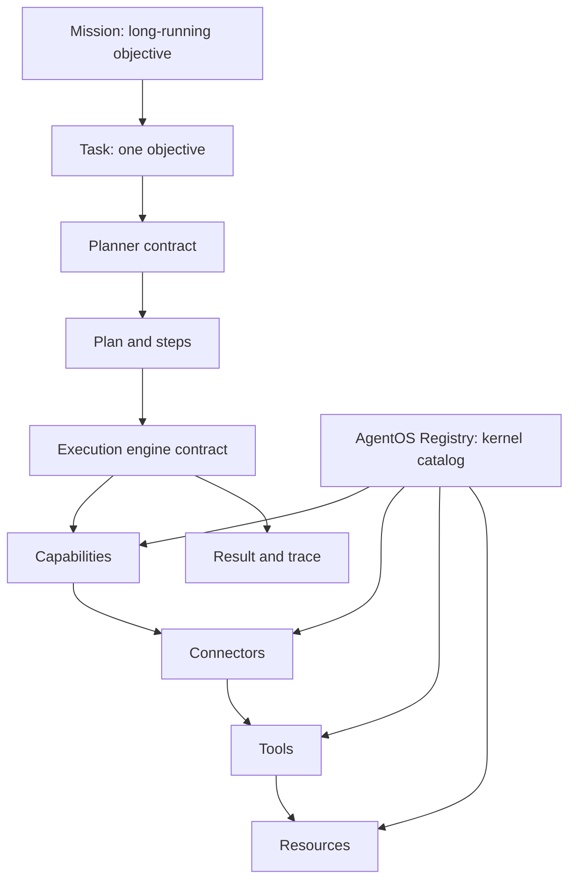

# AgentOS

AgentOS is an open-source AI agent infrastructure layer for the Global South,
starting with Africa.

It exists to help developers build AI agents that can reason, remember, use
tools, and operate across real-world workflows such as messaging, payments,
community management, research, and business operations.

This repository is intentionally starting small. The current work provides the
MVP foundation: shared domain types, a rule-based planner, a simple simulated
execution engine, an in-memory registry, an in-memory memory store, and agent
composition helpers.

AgentOS now includes a simulated `agent.run()` path for local development demos.
It does not yet include real connectors, database-backed memory, LLM
integration, or dashboard functionality.

## Why AgentOS Exists

Most agent infrastructure is designed around well-resourced markets, stable
connectivity, and workflows that do not always reflect how people and businesses
operate across Africa and the wider Global South.

AgentOS aims to provide practical, extensible infrastructure for developers
building agents that understand local contexts, integrate with regional tools,
and support real operational work.

## Monorepo Structure

```text
apps/
  web/          Next.js app shell for the future dashboard and developer console

packages/
  core/         Core planner, execution, registry, and agent composition helpers
  tools/        Placeholder package for future tool definitions and helpers
  memory/       Provider-agnostic memory contracts and in-memory store
  connectors/  Placeholder package for future provider connectors
  sdk/          Developer-facing SDK exports
  types/        Shared TypeScript domain and architecture types
  config/       Shared TypeScript configuration
```

## Architecture

AgentOS is task-centric, not LLM-centric.

Many AI frameworks center the language model:

```text
User -> LLM -> Tools
```

AgentOS centers the work the user wants done:

```text
Mission
  ↓
Task
  ↓
Planner
  ↓
Plan
  ↓
Execution Engine
  ↓
Capabilities
  ↓
Connectors
  ↓
Tools
  ↓
Resources
  ↓
Result
```

The LLM is not the operating center of AgentOS. It is one possible component a
planner or execution engine may use later. The core model starts with tasks,
plans, tools, connectors, memory concepts, context, traces, and results.



## Domain Model

The shared domain model lives in `@agentos/types` and is re-exported from
`@agentos/sdk`.

Current concepts:

- `Mission`: a long-running objective that can generate multiple tasks.
- `Agent`: an autonomous worker with capabilities, tools, memory policy, and
  permissions.
- `Task`: one user objective from a source such as an app, API, chat, or
  workflow.
- `Plan`: the proposed way to complete a task.
- `PlanStep`: one ordered action inside a plan.
- `Capability`: a provider-independent ability such as messaging, search,
  scheduling, payments, or analytics.
- `Tool`: a callable capability with schemas and an execution signature.
- `Connector`: a provider that exposes tools, such as a Discord or payments
  connector.
- `Resource`: anything AgentOS can work with, such as a message, document,
  spreadsheet, transaction, repository, thread, or database record.
- `MemoryRecord`, `MemoryPolicy`, and `MemoryQuery`: storage-agnostic memory
  concepts.
- `ExecutionContext`: the information available while work is being completed.
- `Result`: the final task outcome.
- `ExecutionTrace`: observable history for planning and execution events.
- `Planner`, `PlannerStrategy`, and `ExecutionEngine`: contracts for future
  implementations.
- `CapabilityRegistry`, `ResourceRegistry`, and `ConnectorRegistry`: registry
  interfaces for future runtime discovery.
- `AgentOSRegistry`: the in-memory kernel catalog for capabilities, connectors,
  tools, and resources.
- `MemoryStore` and `InMemoryMemoryStore`: provider-agnostic memory contracts
  and a local in-memory implementation for development.

No database-backed memory, real connectors, dashboard, external APIs, or LLM
calls are implemented yet.

## Architectural Contracts

Phase 3 completes the MVP foundation with interfaces only:

- Missions group long-running work without orchestrating it yet.
- Capabilities describe abstract abilities independently of providers.
- Connectors expose provider-backed capabilities and tools.
- Resources describe the objects AgentOS reads, writes, references, or acts on.
- Planners produce plans through interchangeable strategies such as rule-based,
  LLM-backed, hybrid, or custom planners.
- Execution engines define how plans and steps will eventually be controlled,
  paused, resumed, cancelled, and retried.
- Registries define how capabilities, resources, and connectors will eventually
  be discovered.
- Execution events provide a strongly typed event vocabulary for observability.

The contracts are intentionally provider-agnostic. Discord, Slack, WhatsApp,
Gmail, a local file system, a payment provider, or an LLM provider should be
implementation details behind connectors, tools, or planner strategies.

## Registry Kernel

The first AgentOS kernel component is `AgentOSRegistry`.

It is a central in-memory catalog for discovering what the operating system can
do and what it can work with:

- Capabilities: provider-independent abilities like messaging or payments.
- Connectors: provider-backed integrations that expose capabilities and tools.
- Tools: callable abilities linked to capabilities and optional connector
  origins.
- Resources: objects AgentOS can reference, read, write, or act on.

The registry does not execute tools, call external APIs, persist data, or connect
to providers. It only manages registration, discovery, summaries, and
relationship validation.

## Memory Layer

`InMemoryMemoryStore` is the first memory implementation. It is intentionally
small and local:

- Writes scoped memory records.
- Reads records by id.
- Searches with simple keyword matching across content, type, scope, and
  metadata.
- Lists records globally or by scope.
- Deletes records by id.
- Clears all records or records within a scope.

It does not use a database, vector embeddings, semantic search, LLM extraction,
or external storage.

## Agent Composition

`defineAgent()` creates an immutable `AgentDefinition` from independent AgentOS
components. It is dependency injection first: planners, execution engines,
registries, and memory stores remain replaceable.

An agent definition wires together:

- a planner
- an execution engine
- a registry
- a memory store
- optional capabilities and permissions

This lets developers replace the planner, memory store, execution engine, or
registry without changing the agent definition shape.

`agent.run()` is the first end-to-end runtime path:

```text
Input -> Task -> Planner -> Plan -> Execution Engine -> Result
```

It is still simulated. It does not call real connectors, external APIs, LLMs,
databases, or real-world tools.

## Example Usage

```ts
import {
  AgentOSRegistry,
  CapabilityCategory,
  ConnectorAuthType,
  InMemoryMemoryStore,
  MissionPriority,
  MissionStatus,
  MemoryScope,
  MemoryType,
  ResourceType,
  RuleBasedPlanner,
  SimpleExecutionEngine,
  TaskPriority,
  ToolCategory,
  ToolPermissionLevel,
  createTask,
  defineAgent,
  type Agent,
  type Capability,
  type Mission,
  type RegisteredTool,
  type Resource,
  type Tool,
} from "@agentos/sdk";

const messaging: Capability = {
  id: "capability-messaging",
  name: "Messaging",
  description: "Read and act on messages across provider-backed channels.",
  category: CapabilityCategory.Messaging,
  supportedConnectors: ["discord", "slack", "whatsapp"],
};

const searchMessages: Tool<{ query: string }, { messages: string[] }> = {
  name: "searchMessages",
  description: "Search messages exposed by a connector.",
  category: ToolCategory.Communication,
  inputSchema: {
    type: "object",
    properties: {
      query: { type: "string" },
    },
    required: ["query"],
  },
  outputSchema: {
    type: "object",
    properties: {
      messages: {
        type: "array",
        items: { type: "string" },
      },
    },
  },
  permissionLevel: ToolPermissionLevel.Read,
  execute: async () => {
    throw new Error("Tool execution is not implemented in the architecture phase.");
  },
};

const agent: Agent = {
  id: "agent-community-ops",
  name: "Community Ops Agent",
  description: "Helps community teams understand and respond to member needs.",
  version: "0.1.0",
  capabilities: [{ name: "community-research" }],
  tools: [searchMessages],
  memoryPolicy: {
    enabled: true,
    scopes: [MemoryScope.User, MemoryScope.Organization],
    readableTypes: [MemoryType.Fact, MemoryType.Summary],
    writableTypes: [MemoryType.Summary],
  },
  permissions: [
    {
      resource: "messages",
      level: ToolPermissionLevel.Read,
    },
  ],
};

const task = createTask({
  input: "Find the top complaints from the developer community this week.",
  priority: TaskPriority.High,
  source: {
    type: "api",
    name: "developer-dashboard",
    userId: "user-001",
    organizationId: "org-001",
  },
  metadata: {
    region: "Africa",
  },
});

const mission: Mission = {
  id: "mission-community-growth",
  title: "Grow developer community",
  description: "Increase community engagement and retention this month.",
  objective: "Grow my Discord community by 30% this month.",
  status: MissionStatus.Active,
  priority: MissionPriority.High,
  owner: {
    id: "org-001",
    type: "organization",
    name: "AgentOS",
  },
  tasks: [task],
  createdAt: new Date(),
  updatedAt: new Date(),
  deadline: new Date("2026-08-01T00:00:00.000Z"),
};

const sourceChannel: Resource = {
  id: "resource-discord-builders-channel",
  type: ResourceType.Channel,
  source: "connector-discord",
  uri: "discord://guilds/agentos/channels/builders",
};

const registry = new AgentOSRegistry();
const registeredSearchMessages: RegisteredTool<{ query: string }, { messages: string[] }> = {
  ...searchMessages,
  id: "tool-discord-search-messages",
  capabilityIds: [messaging.id],
  connectorId: "connector-discord",
};

registry.registerCapability(messaging);
registry.registerConnector({
  id: "connector-discord",
  name: "Discord",
  provider: {
    id: "provider-discord",
    name: "discord",
    displayName: "Discord",
  },
  version: {
    current: "0.1.0",
  },
  capabilities: {
    capabilities: [messaging],
    tools: [registeredSearchMessages],
  },
  authType: ConnectorAuthType.OAuth2,
});
registry.registerTool(registeredSearchMessages);
registry.registerResource(sourceChannel);

console.log(registry.findToolsByCapability("capability-messaging"));
console.log(registry.summary());

const memory = new InMemoryMemoryStore();
const memoryWrite = memory.write({
  content: "The user is building AgentOS for open-source AI agents in Africa.",
  type: MemoryType.Fact,
  scope: {
    type: MemoryScope.Project,
    id: "agentos",
  },
});
const memories = memory.search({
  query: "Africa agents",
  scope: {
    type: MemoryScope.Project,
    id: "agentos",
  },
});

console.log(memoryWrite.record);
console.log(memories);

const planner = new RuleBasedPlanner();
const execution = new SimpleExecutionEngine();
const communityManager = defineAgent({
  id: "community-manager",
  name: "Community Manager",
  description: "Manages online communities.",
  planner,
  executionEngine: execution,
  registry,
  memoryStore: memory,
  capabilities: [{ name: "community-management" }],
  permissions: [
    {
      resource: "messages",
      level: ToolPermissionLevel.Read,
    },
  ],
});

console.log(communityManager.summary());
console.log(communityManager.inspect());

const runtimeResult = await communityManager.run(
  "Summarize the top complaints in our Discord community this week"
);

console.log(runtimeResult.answer);
console.log(runtimeResult.trace);

const context = {
  agent,
  task,
  memory: [],
  resources: [sourceChannel],
  variables: {},
  environment: {},
};

const plan = await planner.plan(agent, task, context);

console.log(plan.steps);

const result = await execution.executePlan(agent, task, plan, context);

console.log(result.answer);
console.log(result.trace);
```

The first planner is intentionally simple. `RuleBasedPlanner` inspects task
input and deterministically creates a three-step plan for analysis, messaging,
payment, or default tasks. It does not execute tools, call LLMs, use connectors,
or write memory.

The first execution engine is also intentionally minimal. `SimpleExecutionEngine`
validates the task and plan, processes plan steps in order, simulates step
outputs, emits trace entries, and returns a structured `Result`. It does not run
real tools, call connectors, write memory, or perform real-world actions.

## Runnable Examples

The `examples/` directory contains small TypeScript scripts that demonstrate
the current simulated AgentOS runtime:

```bash
pnpm example:basic
pnpm example:community
pnpm example:business
pnpm example:research
pnpm example:memory
```

Each example creates a registry, memory store, planner, execution engine, and
agent definition before calling `agent.run()`.

- `basic-agent`: smallest end-to-end setup.
- `community-manager`: community complaint summary and next-action planning.
- `business-assistant`: invoice, payment workflow, and follow-up messaging.
- `research-assistant`: grant and research planning workflow.
- `memory-demo`: memory-enabled runs, memory read counts, and a memory-disabled
  run.

Expected output includes the agent name, task, result status, simulated answer,
trace count, memory read count, and step summaries. The examples do not call
real APIs, real connectors, LLMs, databases, or external services.

## Planned Phases

1. Foundation: monorepo, workspace tooling, shared config, and placeholder
   packages.
2. Domain model: task-centric architecture vocabulary, shared types, and SDK
   exports.
3. Architecture contracts: missions, capabilities, resources, planner
   contracts, execution engine contracts, registries, connector manifests, and
   typed execution events.
4. Core implementation: minimal planner and execution engine implementations
   behind the established contracts.
5. Memory layer: storage-agnostic memory interfaces and simple adapters.
6. Connectors: messaging, payments, community, and business workflow
   integrations.
7. SDK and dashboard: developer experience, examples, and observability.

## Getting Started

Install dependencies:

```bash
pnpm install
```

Run the development server:

```bash
pnpm dev
```

Build all workspaces:

```bash
pnpm build
```

Run linting:

```bash
pnpm lint
```

Run type checks:

```bash
pnpm typecheck
```

Format the repository:

```bash
pnpm format
```
