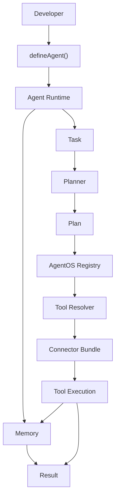

# AgentOS Architecture Diagram

This diagram shows the current local AgentOS developer flow. It reflects the
implemented architecture: local planning, registry discovery, mocked connector
bundles, local tool execution, in-memory memory, and structured results.

## Parts

- **Developer:** creates tools, connectors, memory stores, planners, execution
  engines, and agents through the SDK.
- **defineAgent():** composes an agent from replaceable components. It does not
  require a specific model provider.
- **Agent Runtime:** normalizes input into a task, reads memory when enabled,
  calls the planner, validates the plan, executes it, writes memory when
  enabled, and returns a result.
- **Task:** the unit of work AgentOS executes.
- **Planner:** turns a task into a plan. The current implementation is
  `RuleBasedPlanner`.
- **Plan:** an ordered set of plan steps.
- **AgentOS Registry:** in-memory catalog of capabilities, connectors, tools,
  resources, and connector bundles.
- **Tool Resolver:** selects a registered tool by explicit id, capability, step
  type, or step description.
- **Connector Bundle:** packages a connector with its capabilities, tools, and
  resources. The current realistic bundle is `LocalCommunityConnector`.
- **Tool Execution:** invokes local registered tools. Current tools are mocked
  and deterministic.
- **Memory:** scoped memory records. The current implementation is
  `InMemoryMemoryStore`.
- **Result:** structured output containing status, answer, plan, trace,
  toolCalls, errors, timing, and metadata.

## Current Boundaries

AgentOS currently runs locally. It does not include external provider
integrations, LLM calls, persistent database-backed memory, or production
orchestration.
